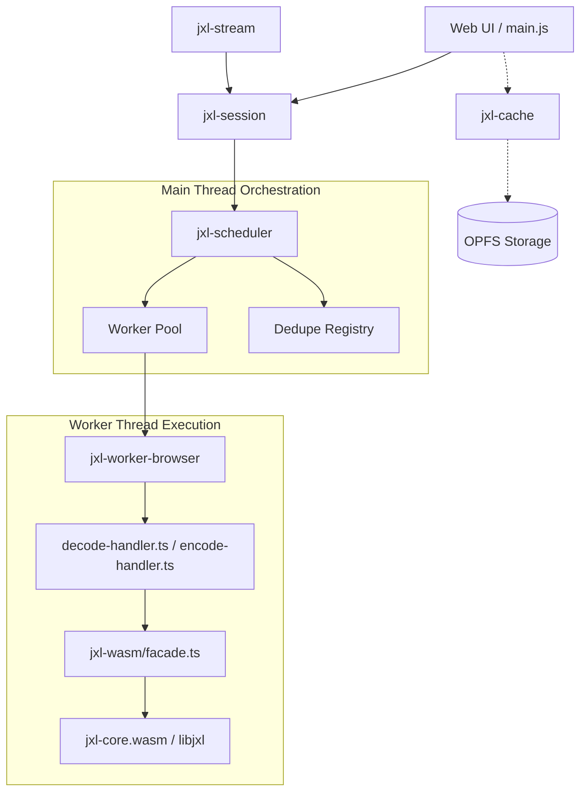

# JXL Jigsaw: How it all fits together

This document maps the relationships between the various packages and files in the CasaWASM JXL & RAW conversion pipeline, extending the concepts in `extended JXL_pathway.md`.

## The Big Picture

The system is designed as a distributed pipeline where heavy lifting (decoding, encoding, demosaicing) happens in **Workers** via **WASM**, while the **Main Thread** handles orchestration, I/O streaming, and resource scheduling.

## Component Roles

### 1. Ingestion Layer (`jxl-stream`)
- **Files**: `packages/jxl-stream/src/browser.ts`
- **Role**: Adapts `ReadableStream`, `Blob`, or `fetch` responses into a standard "push" interface.
- **Jigsaw Fit**: It's the "mouth" of the pipeline. It pipelines I/O so that while chunk $N$ is being decoded in the worker, chunk $N+1$ is already being read from the network/disk.

### 2. Orchestration Layer (`jxl-session`)
- **Files**: `packages/jxl-session/src/decode-session.ts`, `encode-session.ts`
- **Role**: High-level API for the UI. It hides the complexity of workers and scheduling.
- **Jigsaw Fit**: It binds the UI's request to a specific `sessionId` and converts worker messages into an `AsyncEventStream` of frames.

### 3. Intelligence Layer (`jxl-scheduler`)
- **Files**: `packages/jxl-scheduler/src/scheduler.ts`, `pool.ts`, `queue.ts`
- **Role**: The "brain". Manages worker allocation.
- **Jigsaw Fit**:
    - **Preemption**: If a visible image needs decoding but all workers are busy with background tasks, it preempts (pauses/cancels) a background worker.
    - **Deduplication**: If two components request the same image, it only decodes once and "fans out" the results.
    - **Backpressure**: It tells the ingestion layer to "slow down" if the worker's input queue is getting too deep.

### 4. Worker Boundary (`jxl-worker-browser`)
- **Files**: `packages/jxl-worker-browser/src/worker.ts`, `decode-handler.ts`
- **Role**: The bridge between the main thread and WASM.
- **Jigsaw Fit**: `decode-handler.ts` maintains the state of a single `libjxl` decoder instance. It calculates "adaptive high-water marks" to tell the scheduler when it's ready for more data.

### 5. Codec Bridge (`jxl-wasm`)
- **Files**: `packages/jxl-wasm/src/facade.ts`, `src/bridge.cpp`
- **Role**: Direct FFI (Foreign Function Interface) to the C++/Rust WASM code.
- **Jigsaw Fit**: It handles the memory management of the WASM heap. It ensures that binary data is written efficiently into WASM memory and that results are wrapped into JS objects without unnecessary copies.

### 6. RAW Pipeline (`raw-converter-wasm`)
- **Files**: `src/lib.rs`, `src/bin/*`
- **Role**: Handles the ingestion of ORF/DNG raw files.
- **Jigsaw Fit**: It produces the pixels that are eventually fed into the JXL encoder. It uses the `LookRenderer` pattern to allow live RAW editing by keeping the pixel buffer resident in WASM.

### 7. Persistence Layer (`jxl-cache`)
- **Files**: `packages/jxl-cache/src/browser.ts`
- **Role**: Caching of decoded results.
- **Jigsaw Fit**: Sits to the side of the main pipeline. Before starting a decode session, the UI checks `jxl-cache` to see if a version already exists in memory or OPFS.

## Data Flow Example: Loading a JXL
1. **UI** calls `fromResponse(fetch(...), session)`.
2. **jxl-stream** begins reading the response body.
3. **jxl-session** asks **jxl-scheduler** for a slot.
4. **jxl-scheduler** allocates a worker from the **Pool**.
5. **jxl-stream** pushes chunk 1. **jxl-session** transfers it to the **Worker**.
6. **decode-handler** in the worker receives the chunk and pushes it to the **WASM facade**.
7. **Facade** writes to the **libjxl** state.
8. **libjxl** yields a "DC" (preview) frame.
9. **decode-handler** transfers the pixels back to **Main**.
10. **jxl-session** emits a `progress` event; **UI** renders the preview.
11. Repeat for subsequent passes until `final` frame.
12. **jxl-scheduler** releases the worker back to the pool.
